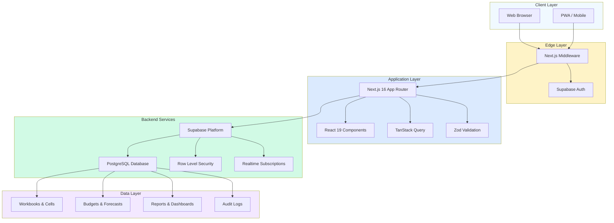
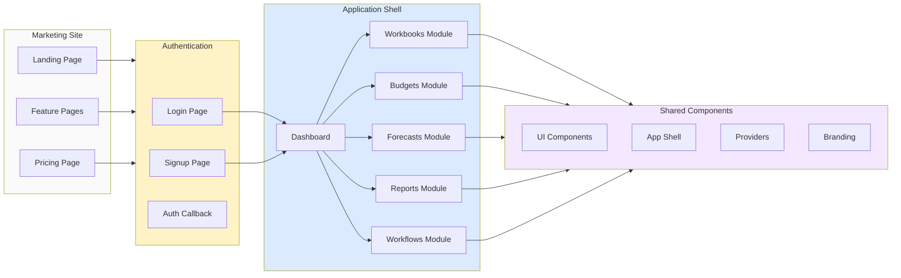
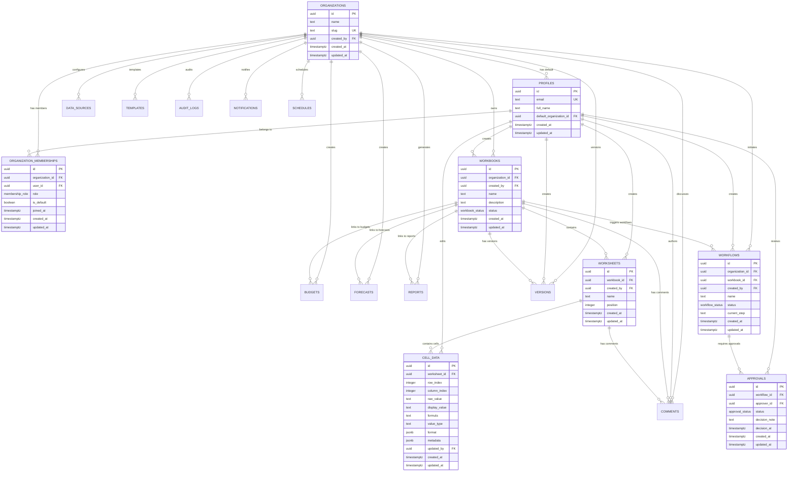
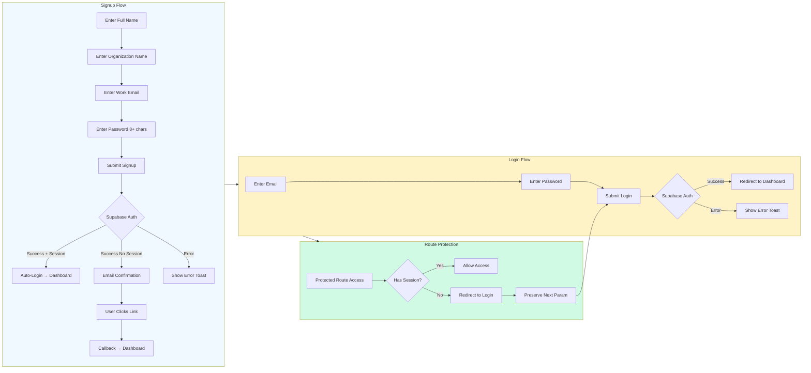
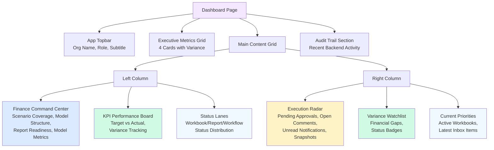

# Native FP&A Platform

[](https://github.com/your-org/native-fpa)
[](LICENSE)
[](https://nextjs.org/)
[](https://react.dev/)
[](https://www.typescriptlang.org/)
[](https://supabase.com/)
[](https://tailwindcss.com/)

**A spreadsheet-native financial planning and analysis (FP&A) platform where spreadsheets meet strategy.**

Native FP&A is a production-grade, web-first planning workspace for budgets, forecasts, approvals, and executive reporting. It preserves the grid mental model finance teams love while replacing version sprawl with a live, auditable operating model.

---

## Table of Contents

- [Abstract](#abstract)
- [Architecture](#architecture)
  - [System Architecture](#system-architecture)
  - [Component Architecture](#component-architecture)
  - [Database Schema](#database-schema)
- [User Flow](#user-flow)
- [Features](#features)
  - [Core Platform](#core-platform)
  - [Financial Planning](#financial-planning)
  - [Collaboration & Governance](#collaboration--governance)
  - [Developer Experience](#developer-experience)
- [Tech Stack](#tech-stack)
- [Project Structure](#project-structure)
- [Quick Start](#quick-start)
- [Environment Variables](#environment-variables)
- [Available Scripts](#available-scripts)
- [API Routes](#api-routes)
- [Database](#database)
  - [Core Tables](#core-tables)
  - [Row Level Security](#row-level-security)
- [Security](#security)
- [Roadmap](#roadmap)
- [License](#license)

---

## Abstract

Modern FP&A software forces a trade-off: the flexibility of spreadsheets or the control of enterprise software. **Native FP&A eliminates this compromise.**

Built on Next.js and Supabase, this platform provides:

- **Spreadsheet-native UX**: Workbook and worksheet mental models with cell-level precision
- **Live collaboration**: Real-time sync without version drift or email attachments
- **Structured workflows**: Approval chains, audit trails, and role-based permissions
- **Executive visibility**: Dashboard-ready metrics, variance analysis, and board-pack exports

The result is a **finance operating system** that feels familiar but behaves like modern software—designed for budget owners, FP&A analysts, approvers, and executives to work from a single source of truth.

---

## Architecture

### System Architecture



### Component Architecture



### Database Schema



---

## User Flow

```mermaid
flowchart TD
    Start([User Visits App]) --> Landing{Has Account?}
    Landing -->|No| Signup[Sign Up]
    Landing -->|Yes| Login[Log In]

    Signup --> SignupForm[Enter Details<br/>Full Name, Organization<br/>Email, Password]
    SignupForm --> OrgCreate[Auto-Create Organization]
    OrgCreate --> ProfileSetup[Create Profile & Membership]
    ProfileSetup --> EmailConfirm{Email Confirm?}
    EmailConfirm -->|Required| Inbox[Check Inbox]
    Inbox --> Login
    EmailConfirm -->|Auto-login| Dashboard

    Login --> LoginForm[Enter Credentials<br/>Email, Password]
    LoginForm --> Auth{Auth Success?}
    Auth -->|No| Error[Show Error]
    Error --> LoginForm
    Auth -->|Yes| Dashboard[Dashboard View]

    Dashboard --> SidebarNav[13 Module Navigation]
    
    SidebarNav --> Workspace[Workspace<br/>Organization & Access]
    SidebarNav --> DashboardNav[Dashboard<br/>Executive Overview]
    SidebarNav --> Analytics[Analytics<br/>KPI Health & Variance]
    SidebarNav --> Workbooks[Workbooks<br/>Spreadsheet-Native Models]
    SidebarNav --> Budgets[Budgets<br/>Planning Cycles]
    SidebarNav --> Forecasts[Forecasts<br/>Rolling Outlook]
    SidebarNav --> Reports[Reports<br/>Exports & Board Packs]
    SidebarNav --> Modeling[Modeling<br/>Scenarios & Structure]
    SidebarNav --> Currencies[Currencies<br/>Base Currency & FX]
    SidebarNav --> Templates[Templates<br/>Reusable Blueprints]
    SidebarNav --> Workflows[Workflows<br/>Approvals & Routing]
    SidebarNav --> Integrations[Integrations<br/>Connected Data]
    SidebarNav --> Inbox[Inbox<br/>Alerts & Actions]

    Dashboard --> Metrics[4 Executive Metrics]
    Dashboard --> CommandCenter[Finance Command Center]
    Dashboard --> ExecRadar[Execution Radar]
    Dashboard --> KPIBoard[KPI Performance Board]
    Dashboard --> VarianceWatch[Variance Watchlist]
    Dashboard --> StatusLanes[Status Lanes]
    Dashboard --> Priorities[Current Priorities]
    Dashboard --> AuditTrail[Recent Backend Activity]

    CommandCenter --> ScenarioCoverage[Scenario Coverage]
    CommandCenter --> ModelStructure[Model Structure]
    CommandCenter --> ReportReadiness[Report Readiness]

    ExecRadar --> PendingApprovals[Pending Approvals]
    ExecRadar --> OpenComments[Open Comments]
    ExecRadar --> UnreadNotifs[Unread Notifications]
    ExecRadar --> Snapshots[Version Snapshots]

    KPIBoard --> TargetVsActual[Target vs Actual]
    KPIBoard --> VariancePct[Variance %]

    StatusLanes --> WorkbookStatus[Workbook Status Distribution]
    StatusLanes --> ReportStatus[Report Status Distribution]
    StatusLanes --> WorkflowStatus[Workflow Status Distribution]

    Priorities --> ActiveWorkbooks[Active Workbooks]
    Priorities --> LatestNotifs[Latest Inbox Items]

    style Start fill:#dbeafe
    style End fill:#d1fae5
    style Landing fill:#fef3c7
    style Dashboard fill:#f3e8ff
    style Signup fill:#dbeafe
    style Login fill:#dbeafe
    style CommandCenter fill:#d1fae5
    style ExecRadar fill:#d1fae5
    style KPIBoard fill:#d1fae5
```



### Authentication Flow



### Dashboard Architecture



---

## Features

### Core Platform

| Feature | Description |
|---------|-------------|
| **Workbook-Native Modeling** | Structure planning cycles around workbooks, worksheets, formulas, and scenario assumptions—just like spreadsheets |
| **Centralized Cloud Data** | Move out of email attachments into a source-of-truth data model designed for finance teams |
| **Realtime Collaboration** | Let operators, approvers, and executives work from the same workbook without version drift |
| **Role-Based Access Control** | Define who can edit, review, publish, and export across organization-scoped workspaces (admin, editor, viewer, approver) |
| **Version Control** | Track every change with labeled snapshots and audit-ready version history |
| **Multi-Organization Support** | Users can belong to multiple organizations with distinct roles and permissions |
| **Workspace Context** | Sidebar displays active workspace, organization name, user profile, and membership role |

### Financial Planning

| Module | Capabilities |
|--------|-------------|
| **Dashboard** | Executive metrics, finance command center, execution radar, KPI performance board, variance watchlist, status lanes |
| **Analytics** | KPI health tracking, variance analysis, metric performance monitoring |
| **Workbooks** | Spreadsheet-native models with worksheets, cells, formulas, and collaborative editing |
| **Budgets** | Create annual/quarterly budgets, track plan vs. actual, manage budget owners, lock periods |
| **Forecasts** | Build rolling forecasts, define forecast horizons, link to workbooks, track forecast confidence |
| **Reports** | Generate P&L, balance sheet, cash flow statements; export to PDF/Excel; schedule automated delivery |
| **Modeling** | Scenario planning, accounts structure, cost centers, dimensions configuration |
| **Currencies** | Base currency settings, exchange rate management, FX context for multi-currency planning |
| **Templates** | Reuse planning templates across cycles, share best-practice models, accelerate setup |
| **Workflows** | Configure approval chains, track approval status, manage revision requests, audit decision trails |
| **Integrations** | Connect external data sources, sync with accounting systems, import/export data |

### Dashboard Components

| Component | Description |
|-----------|-------------|
| **Executive Metrics** | 4 cards displaying key metrics with variance indicators (favorable/unfavorable) |
| **Finance Command Center** | Scenario coverage, model structure (accounts + cost centers), report readiness ratio, model metrics |
| **Execution Radar** | Pending approvals, open comments, unread notifications, version snapshots with visual progress bars |
| **KPI Performance Board** | Target vs. actual comparison, variance percentage, progress bars, status badges |
| **Variance Watchlist** | Financial gaps needing explanation, period labels, variance values and percentages, status badges |
| **Status Lanes** | Distribution across workbook, report, and workflow states with visual bars |
| **Current Priorities** | Active workbooks with owner/collaborator info, latest inbox items with read/unread status |
| **Audit Trail** | Recent backend activity showing entity type, action, and timestamp |

### Collaboration & Governance

| Feature | Description |
|---------|-------------|
| **Cell-Level Comments** | Anchor discussions to specific cells, rows, or columns for contextual review |
| **Approval Workflows** | Route workbooks through multi-step approval chains with decision notes |
| **Audit Logging** | Track every action with actor, entity, timestamp, and change details |
| **Notifications** | In-app notifications for approvals, comments, mentions, and system updates with inbox management |
| **Scheduled Reports** | Automate report generation and delivery with cron-based scheduling |
| **Status Tracking** | Workbook statuses (draft, in_review, published, archived), report statuses, workflow statuses |

### Developer Experience

| Feature | Description |
|---------|-------------|
| **Type-Safe APIs** | Zod-validated request/response schemas with full TypeScript inference |
| **Row Level Security** | Database-level access control enforced by Supabase RLS policies |
| **Modular Architecture** | Route groups for marketing, auth, and app; clean separation of concerns |
| **Production-Grade UI** | shadcn/ui components with glassmorphism design system and dark mode |
| **Comprehensive Error Handling** | Global error boundaries, typed error responses, graceful fallbacks |
| **Supabase Integration** | Browser client for client-side ops, server client for SSR, middleware for auth |

---

## Tech Stack

| Layer | Technology | Purpose |
|-------|-----------|---------|
| **Framework** | Next.js 16 (App Router) | Full-stack React framework with server components, route groups, middleware |
| **Language** | TypeScript 5 | Type-safe development with strict mode, custom types for domain models |
| **UI Library** | React 19 | Component-based UI with concurrent features, Suspense for loading states |
| **Styling** | Tailwind CSS 4 | Utility-first CSS with custom design tokens, glassmorphism, animations |
| **Components** | shadcn/ui + Radix UI | Accessible, unstyled component primitives (card, badge, button, input) |
| **Icons** | Lucide React | Modern, consistent icon set (50+ icons used across the app) |
| **Animations** | Framer Motion | Gesture-based animations, motion reveal, float/fade/slide effects |
| **State** | TanStack Query 5 | Server state management, caching, optimistic updates |
| **Forms** | React Hook Form + Zod | Type-safe form validation with minimal re-renders |
| **Database** | PostgreSQL (Supabase) | Relational database with JSONB support, 18 core tables |
| **Auth** | Supabase Auth | JWT-based authentication, email/password, OAuth ready, email confirmation |
| **Realtime** | Supabase Realtime | Live subscriptions for collaborative features (ready for implementation) |
| **RLS** | Supabase RLS | Row-level security policies enforced at database level |
| **Deployment** | Vercel / Docker | Edge-ready deployment platform |

### Supabase Integration

```
┌─────────────────────────────────────────────────────────────┐
│                    Supabase Client Architecture              │
├─────────────────────────────────────────────────────────────┤
│                                                              │
│  Browser Client (client.ts)                                  │
│  - Client-side operations                                    │
│  - Auth sign in/up/out                                       │
│  - Used in forms and interactive components                  │
│                                                              │
│  Server Client (server.ts)                                   │
│  - Server-side rendering (SSR)                               │
│  - Cookie-based session management                           │
│  - Used in page components for data fetching                 │
│                                                              │
│  Middleware (middleware.ts)                                  │
│  - Route protection for /dashboard, /workbooks, etc.         │
│  - Session refresh and cookie sync                           │
│  - Redirect to /login if unauthorized                        │
│                                                              │
│  Current User (current-user.ts)                              │
│  - Workspace context retrieval                               │
│  - User, profile, membership, organization data              │
│  - Used in app layout for sidebar context                    │
│                                                              │
└─────────────────────────────────────────────────────────────┘
```

---

## Application Navigation

### Sidebar Navigation (13 Modules)

The application shell includes a persistent sidebar with navigation to all modules:

| Module | Route | Description |
|--------|-------|-------------|
| **Workspace** | `/workspace` | Organization settings and access control |
| **Dashboard** | `/dashboard` | Executive overview with KPIs and metrics |
| **Analytics** | `/analytics` | KPI health tracking and variance analysis |
| **Workbooks** | `/workbooks` | Spreadsheet-native financial models |
| **Budgets** | `/budgets` | Planning cycles and budget approvals |
| **Forecasts** | `/forecasts` | Rolling forecasts and scenario planning |
| **Reports** | `/reports` | Report generation and board pack exports |
| **Modeling** | `/modeling` | Scenario configuration and finance structure |
| **Currencies** | `/currencies` | Base currency and FX rate management |
| **Templates** | `/templates` | Reusable planning blueprints |
| **Workflows** | `/workflows` | Approval chains and review routing |
| **Integrations** | `/integrations` | Connected data sources and sync |
| **Inbox** | `/notifications` | Alerts, mentions, and action items |

### Sidebar Components

- **Brand Mark**: App logo at top
- **Workspace Context**: Shows active organization name, user name, email
- **Navigation Items**: 13 modules with labels and descriptions
- **User Profile**: Initials avatar, user name, email, sign out button

### Route Protection

All routes under `(app)/` route group are protected by middleware:

```typescript
// middleware.ts
export const config = {
  matcher: [
    "/dashboard/:path*",
    "/workbooks/:path*",
    "/budgets/:path*",
    "/reports/:path*",
    // ... all app routes
  ],
};

// Redirects to /login if no valid session
// Preserves `next` param for post-login redirect
```

---

## Dashboard Deep Dive

The dashboard is the central hub of Native FP&A, providing executive visibility into planning health across workbooks, scenarios, KPIs, and approvals.

### Dashboard Layout

```
┌────────────────────────────────────────────────────────────────┐
│  App Topbar                                                    │
│  Organization Name | Role | Executive Overview Subtitle        │
├────────────────────────────────────────────────────────────────┤
│                                                                │
│  Executive Metrics Grid (4 cards)                              │
│  ┌──────────┐ ┌──────────┐ ┌──────────┐ ┌──────────┐         │
│  │ Metric 1 │ │ Metric 2 │ │ Metric 3 │ │ Metric 4 │         │
│  └──────────┘ └──────────┘ └──────────┘ └──────────┘         │
│                                                                │
│  ┌─────────────────────────┐ ┌─────────────────────────┐      │
│  │ Finance Command Center  │ │ Execution Radar         │      │
│  │ - Scenario Coverage     │ │ - Pending Approvals     │      │
│  │ - Model Structure       │ │ - Open Comments         │      │
│  │ - Report Readiness      │ │ - Unread Notifications  │      │
│  │ - Model Metrics         │ │ - Snapshots             │      │
│  └─────────────────────────┘ └─────────────────────────┘      │
│                                                                │
│  ┌─────────────────────────┐ ┌─────────────────────────┐      │
│  │ KPI Performance Board   │ │ Variance Watchlist      │      │
│  │ - Target vs Actual      │ │ - Financial Gaps        │      │
│  │ - Variance %            │ │ - Status Badges         │      │
│  │ - Progress Bars         │ │ - Period Labels         │      │
│  └─────────────────────────┘ └─────────────────────────┘      │
│                                                                │
│  ┌─────────────────────────┐ ┌─────────────────────────┐      │
│  │ Status Lanes            │ │ Current Priorities      │      │
│  │ - Workbook Distribution │ │ - Active Workbooks      │      │
│  │ - Report Distribution   │ │ - Latest Inbox Items    │      │
│  │ - Workflow Distribution │ │                         │      │
│  └─────────────────────────┘ └─────────────────────────┘      │
│                                                                │
│  Recent Backend Activity (Audit Trail)                         │
│  ┌────────────────────────────────────────────────────────┐   │
│  │ - Entity Type | Action | Timestamp                     │   │
│  └────────────────────────────────────────────────────────┘   │
└────────────────────────────────────────────────────────────────┘
```

### Dashboard Components

#### 1. Executive Metrics (4 Cards)
- Displays key metrics with variance indicators
- Variants: favorable (green/success), unfavorable (orange/warning), neutral
- Change percentage tracking with trend indicators

#### 2. Finance Command Center
Dark-themed premium card showing:
- **Scenario Coverage**: Total scenarios, active count, linked forecasts
- **Model Structure**: Accounts + cost centers ready for analysis
- **Report Readiness**: Reports/workflows ratio for current cycle
- **Model Metrics Grid**: Accounts, cost centers, dimensions, exchange rates

#### 3. Execution Radar
Workload and review pressure indicators:
- **Pending Approvals**: Decision queue count with progress bar
- **Open Comments**: Model review backlog
- **Unread Notifications**: Personal inbox count
- **Snapshots**: Version recovery points

#### 4. KPI Performance Board
Target vs. actual highlights:
- KPI name and target value
- Actual value with variance percentage
- Progress bar showing % of target achieved
- Status badges (favorable/unfavorable)
- Change percentage with trend direction

#### 5. Variance Watchlist
Financial gaps needing explanation:
- Variance name and period label
- Variance value (formatted currency)
- Variance percentage with +/− indicator
- Status badges (favorable/unfavorable)

#### 6. Status Lanes
Distribution across states:
- **Workbooks**: draft, in_review, published, archived
- **Reports**: draft, generated, published, archived
- **Workflows**: draft, pending_approval, approved, rejected
- Visual bars showing count distribution

#### 7. Current Priorities
Most relevant items for current session:
- **Active Workbooks**: Name, description, status badge, owner, collaborators
- **Latest Inbox Items**: Title, kind badge, body, read/unread status

#### 8. Audit Trail
Recent backend activity:
- Action name (formatted from snake_case)
- Entity type
- Timestamp (localized format)

### Data Fetching

Dashboard uses server-side data fetching via `getDashboardPageData()`:

```typescript
// lib/server/app-data.ts
export async function getDashboardPageData() {
  // Returns:
  // - context: Workspace context (user, profile, membership, organization)
  // - metrics: Executive metrics array
  // - scenarioSummary: Active/total scenarios, linked forecasts
  // - modelCoverage: Accounts, cost centers, dimensions, exchange rates
  // - planningCounts: Reports, workflows, versions
  // - pendingApprovals, openComments, unreadNotifications
  // - metricHighlights: KPI performance data
  // - varianceHighlights: Variance watchlist data
  // - workbookStatusBreakdown, reportStatusBreakdown, workflowStatusBreakdown
  // - workbooks: Active workbook list
  // - latestNotifications: Recent inbox items
  // - recentAuditEvents: Recent audit trail
}
```

### Badge Variants

| Variant | Use Case | Color |
|---------|----------|-------|
| `success` | Favorable variance, published status | Green |
| `warning` | Unfavorable variance, in_review status | Amber/Orange |
| `gradient` | Unread notifications, active items | Blue-Purple gradient |
| `secondary` | Draft status, read notifications | Neutral |

---

## Project Structure

```
NativeFinancialPlanning/
├── src/
│   ├── app/                          # Next.js App Router
│   │   ├── (marketing)/              # Public marketing pages (route group)
│   │   │   ├── page.tsx              # Landing page with Hero + FeatureGrid
│   │   │   ├── features/             # Feature pages
│   │   │   └── pricing/              # Pricing page
│   │   ├── (auth)/                   # Authentication routes (route group)
│   │   │   ├── login/                # Login page with login form
│   │   │   ├── signup/               # Signup page with signup form
│   │   │   ├── auth-page.tsx         # Shared auth page component
│   │   │   └── layout.tsx            # Auth layout
│   │   ├── (app)/                    # Protected application routes (route group)
│   │   │   ├── layout.tsx            # App shell with sidebar
│   │   │   ├── analytics/            # KPI health & variance analytics
│   │   │   ├── budgets/              # Budget planning cycles
│   │   │   ├── currencies/           # Currency & FX management
│   │   │   ├── dashboard/            # Executive dashboard (main hub)
│   │   │   │   └── page.tsx          # Dashboard page with all widgets
│   │   │   ├── forecasts/            # Rolling forecasts
│   │   │   ├── integrations/         # Third-party integrations
│   │   │   ├── modeling/             # Scenario & structure modeling
│   │   │   ├── notifications/        # Inbox & alerts
│   │   │   ├── reports/              # Report generation & exports
│   │   │   ├── templates/            # Template library
│   │   │   ├── workbooks/            # Workbook management
│   │   │   └── workflows/            # Approval workflows
│   │   ├── api/                      # API routes
│   │   │   ├── analytics/            # Usage analytics
│   │   │   ├── approvals/            # Approval actions
│   │   │   ├── auth/                 # Auth callbacks
│   │   │   ├── budgets/              # Budget endpoints
│   │   │   ├── cells/                # Cell operations
│   │   │   ├── comments/             # Comment threads
│   │   │   ├── currencies/           # Currency rates
│   │   │   ├── data/                 # Data sources
│   │   │   ├── exports/              # Data exports
│   │   │   ├── forecasts/            # Forecast endpoints
│   │   │   ├── health/               # Health checks
│   │   │   ├── imports/              # Data imports
│   │   │   ├── integrations/         # Integration connections
│   │   │   ├── notifications/        # Notification center
│   │   │   ├── organizations/        # Org management
│   │   │   ├── permissions/          # Permission checks
│   │   │   ├── reports/              # Report endpoints
│   │   │   ├── schedules/            # Scheduled tasks
│   │   │   ├── templates/            # Template endpoints
│   │   │   ├── users/                # User management
│   │   │   ├── versions/             # Version control
│   │   │   ├── workbooks/            # Workbook CRUD
│   │   │   └── workflows/            # Workflow endpoints
│   │   ├── globals.css               # Global styles with glassmorphism
│   │   ├── layout.tsx                # Root layout with fonts & theme
│   │   ├── error.tsx                 # Error boundary
│   │   ├── global-error.tsx          # Global error handler
│   │   └── icon.svg                  # App icon
│   │
│   ├── components/
│   │   ├── app/                      # App-specific components
│   │   │   ├── integration-hub.tsx
│   │   │   ├── new-workbook-form.tsx
│   │   │   ├── notification-center.tsx
│   │   │   ├── planning-create-form.tsx
│   │   │   ├── reporting-studio.tsx
│   │   │   ├── template-library.tsx
│   │   │   ├── workbook-workspace.tsx
│   │   │   ├── workflow-board.tsx
│   │   │   └── workspace-settings.tsx
│   │   ├── auth/                     # Auth components
│   │   │   ├── login-form.tsx        # Email/password login
│   │   │   ├── signup-form.tsx       # Signup with org creation
│   │   │   └── sign-out-button.tsx
│   │   ├── branding/                 # Brand assets
│   │   │   └── brand-mark.tsx
│   │   ├── dashboard/                # Dashboard widgets
│   │   │   ├── metric-card.tsx
│   │   │   └── ...
│   │   ├── marketing/                # Marketing components
│   │   │   ├── feature-grid.tsx
│   │   │   ├── hero.tsx
│   │   │   └── motion-reveal.tsx
│   │   ├── providers/                # Context providers
│   │   │   └── app-providers.tsx
│   │   ├── shell/                    # App shell components
│   │   │   ├── app-sidebar.tsx       # 13-module navigation
│   │   │   └── app-topbar.tsx        # Top bar with org context
│   │   ├── ui/                       # Base UI components (shadcn/ui)
│   │   │   ├── badge.tsx
│   │   │   ├── button.tsx
│   │   │   ├── card.tsx
│   │   │   ├── error-boundary.tsx
│   │   │   ├── input.tsx
│   │   │   ├── skeleton.tsx
│   │   │   ├── theme-toggle.tsx
│   │   │   └── theme-toggle-wrapper.tsx
│   │   └── workbooks/                # Workbook components
│   │
│   ├── hooks/                        # Custom React hooks
│   │
│   └── lib/
│       ├── api/                      # API utilities
│       │   ├── audit.ts              # Audit logging
│       │   ├── route-helpers.ts      # Route helpers
│       │   └── workbook-snapshots.ts # Version snapshots
│       ├── config/                   # Configuration
│       │   └── navigation.ts         # Nav config (marketingNav, appNav)
│       ├── data/                     # Mock data (dev)
│       ├── schemas/                  # Zod schemas
│       │   ├── auth.ts               # Login/signup validation
│       │   ├── cells.ts              # Cell data validation
│       │   ├── imports.ts            # Import validation
│       │   ├── resources.ts          # Resource validation
│       │   └── workbooks.ts          # Workbook validation
│       ├── server/                   # Server utilities
│       │   ├── app-data.ts           # Dashboard data fetching
│       │   └── ...
│       ├── supabase/                 # Supabase clients
│       │   ├── client.ts             # Browser client (client-side)
│       │   ├── server.ts             # Server client (SSR)
│       │   ├── middleware.ts         # Auth middleware
│       │   └── current-user.ts       # Current user context
│       ├── env.ts                    # Environment validation (Zod)
│       ├── types.ts                  # TypeScript types & interfaces
│       └── utils.ts                  # Utility functions (cn, etc.)
│
├── supabase/
│   ├── migrations/                   # Database migrations
│   │   ├── 20260314131500_initial_platform_schema.sql
│   │   │   └── Core schema: orgs, profiles, memberships, workbooks,
│   │   │       worksheets, cell_data, budgets, forecasts, reports,
│   │   │       workflows, approvals, versions, comments, templates,
│   │   │       audit_logs + RLS policies + triggers
│   │   ├── 20260314193000_notifications_and_schedules.sql
│   │   │   └── Notifications table, schedules table, RLS policies
│   │   └── 20260314201500_backend_hardening.sql
│   │       └── Additional indexes, security hardening
│   └── .temp/                        # Temp files
│
├── public/                           # Static assets
├── middleware.ts                     # Next.js auth middleware
├── next.config.ts                    # Next.js configuration
├── tailwind.config.ts                # Tailwind with animations & glassmorphism
├── components.json                   # shadcn/ui config
├── tsconfig.json                     # TypeScript config
├── package.json                      # Dependencies
└── .env.example                      # Environment template
```

---

## Quick Start

### Prerequisites

- **Node.js** 20+ ([install](https://nodejs.org/))
- **npm** or **pnpm**
- **Supabase account** ([sign up](https://supabase.com/))

### Installation

```bash
# Clone the repository
git clone https://github.com/your-org/native-fpa.git
cd NativeFinancialPlanning

# Install dependencies
npm install

# Copy environment variables
cp .env.example .env.local

# Configure your Supabase credentials in .env.local
# NEXT_PUBLIC_SUPABASE_URL=https://your-project.supabase.co
# NEXT_PUBLIC_SUPABASE_ANON_KEY=your-anon-key

# Run database migrations (in Supabase SQL Editor)
# Apply all migrations from supabase/migrations/

# Start development server
npm run dev
```

Open [http://localhost:3000](http://localhost:3000) to see the application.

---

## Environment Variables

| Variable | Description | Required |
|----------|-------------|----------|
| `NEXT_PUBLIC_APP_URL` | Base URL for the application | Yes (for production) |
| `NEXT_PUBLIC_SUPABASE_URL` | Supabase project URL | Yes |
| `NEXT_PUBLIC_SUPABASE_ANON_KEY` | Supabase anonymous key | Yes |

### Example `.env.local`

```bash
NEXT_PUBLIC_APP_URL=http://localhost:3000
NEXT_PUBLIC_SUPABASE_URL=https://xxxxxxxxxxxxx.supabase.co
NEXT_PUBLIC_SUPABASE_ANON_KEY=eyJhbGciOiJIUzI1NiIsInR5cCI6IkpXVCJ9...
```

---

## Available Scripts

| Command | Description |
|---------|-------------|
| `npm run dev` | Start development server on port 3000 |
| `npm run build` | Build for production |
| `npm run start` | Start production server |
| `npm run lint` | Run ESLint |
| `npm run typecheck` | Run TypeScript type checking |
| `npm run format` | Format code with Prettier |
| `npm run clean` | Remove build artifacts and cache |

---

## API Routes

### Authentication

| Endpoint | Method | Description |
|----------|--------|-------------|
| `/api/auth/callback` | GET | OAuth callback handler |
| `/api/auth/signout` | POST | Sign out user |

### Workbooks

| Endpoint | Method | Description |
|----------|--------|-------------|
| `/api/workbooks` | GET | List workbooks |
| `/api/workbooks` | POST | Create workbook |
| `/api/workbooks/[id]` | GET | Get workbook by ID |
| `/api/workbooks/[id]` | PUT | Update workbook |
| `/api/workbooks/[id]` | DELETE | Delete workbook |

### Cells

| Endpoint | Method | Description |
|----------|--------|-------------|
| `/api/cells` | GET | List cells for worksheet |
| `/api/cells` | POST | Create/update cell |
| `/api/cells/batch` | POST | Batch cell operations |

### Budgets

| Endpoint | Method | Description |
|----------|--------|-------------|
| `/api/budgets` | GET | List budgets |
| `/api/budgets` | POST | Create budget |
| `/api/budgets/[id]` | GET | Get budget |
| `/api/budgets/[id]` | PUT | Update budget |

### Forecasts

| Endpoint | Method | Description |
|----------|--------|-------------|
| `/api/forecasts` | GET | List forecasts |
| `/api/forecasts` | POST | Create forecast |
| `/api/forecasts/[id]` | GET | Get forecast |
| `/api/forecasts/[id]` | PUT | Update forecast |

### Reports

| Endpoint | Method | Description |
|----------|--------|-------------|
| `/api/reports` | GET | List reports |
| `/api/reports` | POST | Create report |
| `/api/reports/[id]` | GET | Get report |
| `/api/reports/[id]/generate` | POST | Generate report |

### Workflows

| Endpoint | Method | Description |
|----------|--------|-------------|
| `/api/workflows` | GET | List workflows |
| `/api/workflows` | POST | Create workflow |
| `/api/workflows/[id]` | GET | Get workflow |
| `/api/workflows/[id]/submit` | POST | Submit for approval |

### Approvals

| Endpoint | Method | Description |
|----------|--------|-------------|
| `/api/approvals` | GET | List approvals |
| `/api/approvals/[id]` | PUT | Update approval (approve/reject) |

### Comments

| Endpoint | Method | Description |
|----------|--------|-------------|
| `/api/comments` | GET | List comments |
| `/api/comments` | POST | Create comment |
| `/api/comments/[id]` | PUT | Update comment |
| `/api/comments/[id]` | DELETE | Delete comment |
| `/api/comments/[id]/resolve` | POST | Resolve comment |

### Versions

| Endpoint | Method | Description |
|----------|--------|-------------|
| `/api/versions` | GET | List versions |
| `/api/versions` | POST | Create version snapshot |
| `/api/versions/[id]` | GET | Get version |
| `/api/versions/[id]/restore` | POST | Restore version |

### Organizations

| Endpoint | Method | Description |
|----------|--------|-------------|
| `/api/organizations` | GET | List organizations |
| `/api/organizations` | POST | Create organization |
| `/api/organizations/[id]` | GET | Get organization |
| `/api/organizations/[id]` | PUT | Update organization |

### Users

| Endpoint | Method | Description |
|----------|--------|-------------|
| `/api/users/me` | GET | Get current user profile |
| `/api/users/me` | PUT | Update current user profile |

### Notifications

| Endpoint | Method | Description |
|----------|--------|-------------|
| `/api/notifications` | GET | List notifications |
| `/api/notifications/[id]/read` | POST | Mark as read |
| `/api/notifications/unread-count` | GET | Get unread count |

### Schedules

| Endpoint | Method | Description |
|----------|--------|-------------|
| `/api/schedules` | GET | List schedules |
| `/api/schedules` | POST | Create schedule |
| `/api/schedules/[id]` | PUT | Update schedule |

### Imports

| Endpoint | Method | Description |
|----------|--------|-------------|
| `/api/imports` | POST | Import data (CSV, Excel) |
| `/api/imports/[id]/status` | GET | Get import status |

### Exports

| Endpoint | Method | Description |
|----------|--------|-------------|
| `/api/exports/workbook/[id]` | GET | Export workbook (Excel, PDF) |
| `/api/exports/report/[id]` | GET | Export report (PDF, CSV) |

### Integrations

| Endpoint | Method | Description |
|----------|--------|-------------|
| `/api/integrations` | GET | List integrations |
| `/api/integrations/[provider]/connect` | POST | Connect integration |
| `/api/integrations/[provider]/disconnect` | POST | Disconnect integration |

### Health

| Endpoint | Method | Description |
|----------|--------|-------------|
| `/api/health` | GET | Health check |
| `/api/health/database` | GET | Database health |

---

## Database

### Core Tables

| Table | Description |
|-------|-------------|
| `organizations` | Multi-tenant organization records |
| `profiles` | User profiles linked to auth.users |
| `organization_memberships` | User-org relationships with roles |
| `workbooks` | Planning workbooks (budget models, forecasts) |
| `worksheets` | Worksheets within workbooks |
| `cell_data` | Individual cell values, formulas, formats |
| `data_sources` | External data connections |
| `budgets` | Budget planning cycles |
| `forecasts` | Forecast models |
| `reports` | Generated reports |
| `workflows` | Approval workflows |
| `approvals` | Individual approval decisions |
| `versions` | Workbook version snapshots |
| `comments` | Cell-level and workbook comments |
| `templates` | Reusable planning templates |
| `audit_logs` | Immutable audit trail |
| `notifications` | In-app notifications |
| `schedules` | Scheduled report generation |

### Row Level Security

All tables have RLS enabled with policies enforcing:

- **Organization membership**: Users can only access data from organizations they belong to
- **Role-based permissions**: Admin, editor, viewer, and approver roles control access
- **Workbook-level access**: Fine-grained control based on workbook membership
- **Audit trail**: All mutating actions are logged with actor context

Example policy:
```sql
-- Users can only select workbooks from their organizations
CREATE POLICY "workbooks_select_member"
ON workbooks
FOR SELECT
TO authenticated
USING (public.is_org_member(organization_id));
```

---

## Security

### Authentication

- **Supabase Auth** with JWT tokens
- **Session management** via HTTP-only cookies
- **OAuth providers** ready (Google, GitHub, etc.)
- **Magic link** and **email/password** authentication

### Authorization

- **Row Level Security (RLS)** enforced at database level
- **Role-based access control** (admin, editor, viewer, approver)
- **Organization-scoped permissions**
- **Workbook-level access control**

### Audit & Compliance

- **Immutable audit logs** for all mutating actions
- **Version history** with labeled snapshots
- **Comment threads** anchored to cells or workbooks
- **Approval trails** with decision notes and timestamps

### Data Protection

- **HTTPS-only** in production
- **Encrypted connections** to Supabase
- **No sensitive data** in client-side logs
- **Input validation** with Zod schemas

---

## Roadmap

### Phase 1: Core Platform (Current)
- [x] Authentication and onboarding
- [x] Workbook CRUD operations
- [x] Worksheet and cell data model
- [x] Dashboard with metrics
- [x] Marketing site
- [ ] Real-time cell sync (Supabase Realtime)
- [ ] Formula engine
- [ ] Cell formatting and validation

### Phase 2: Collaboration
- [ ] Comments and mentions
- [ ] Approval workflows
- [ ] Version control UI
- [ ] Activity feed
- [ ] Notifications center

### Phase 3: Financial Planning
- [ ] Budget cycle management
- [ ] Forecast modeling
- [ ] Report builder
- [ ] Variance analysis
- [ ] Executive dashboards

### Phase 4: Integrations
- [ ] Excel import/export
- [ ] QuickBooks integration
- [ ] NetSuite integration
- [ ] Slack notifications
- [ ] Google Sheets sync

### Phase 5: Enterprise
- [ ] SSO (SAML, OIDC)
- [ ] Advanced permissions
- [ ] Custom fields
- [ ] API rate limiting
- [ ] Usage analytics

---

## Contributing

Contributions are welcome! Please read our contributing guidelines before submitting PRs.

1. Fork the repository
2. Create a feature branch (`git checkout -b feature/amazing-feature`)
3. Commit your changes (`git commit -m 'Add amazing feature'`)
4. Push to the branch (`git push origin feature/amazing-feature`)
5. Open a Pull Request

---

## License

This project is licensed under the MIT License - see the [LICENSE](LICENSE) file for details.

---

## Acknowledgments

- [Next.js](https://nextjs.org/) - The React Framework
- [Supabase](https://supabase.com/) - The Open Source Firebase Alternative
- [shadcn/ui](https://ui.shadcn.com/) - Beautifully designed components
- [Tailwind CSS](https://tailwindcss.com/) - Utility-first CSS framework
- [Framer Motion](https://www.framer.com/motion/) - Animation library

---

**Built with ❤️ for finance teams who deserve better tools.**
